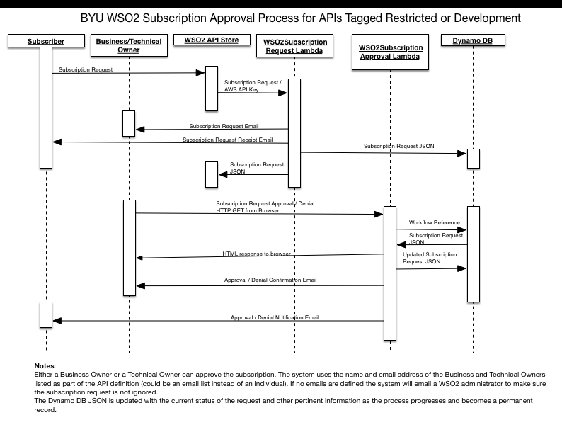

## BYU WSO2 Subscription Request AWS Lambda

This is the first of the Lambda functions involved in the processing of subscription approvals for restricted apis.
See [https://github.com/byu-oit-appdev/wso2-custom-workflow-extensions] for the initial WSO2 workflow extension that starts the process.

The process is as follows:


### Requirements:

1. AWS Boto3 must be installed and configured with access keys for local development and testing.
1. Uses [Airspeed](https://github.com/purcell/airspeed) for Velocity compatible template processing. Airspeed must be installed locally for this project to be included
in the zip file and recognized by Lambdas.
1. An S3 Bucket that must contain configuration and email templates (see [Configuration](#Configuration))
1. An DynamoDB table must be defined named "WSO2SubscriptionRequest"
1. An IAM policy must exist that will give the lambdas access to S3 (read only), the Dynamo DB table, and SES.
1. SES must be configured and approved to process email.

### Packaging:
1. Use `pip install --upgrade --target . airspeed `
   from the root of the project to install Airspeed and its dependent packages into the project directory.
1. Zip the contents of the root directory into a single file. Be sure to get sub directories. `zip -r AWSLambda.zip .` should
work on *nix based systems.

### Deployment:
1. Create a new AWS Lambda.
    1. Give it the same name as the project.
    1. Give it a description.
    1. Set the runtime to be Python 2.7.
    1. Set the code entry type to upload a zip file.
    1. Specify the location of the zip file.
    1. Specify the IAM role containing the permissions for the lambda.
    1. Create the lambda.
    1. A test event can be configured by using the sample events in the tests.

1. Create an AWS API Gateway API for the lambda.
    1. Import the `swagger.json` file to create the api definition. The `swagger.json` file has API Gateway extensions that
    will do the following:
        1. Configure the `POST` method on the `/subscriptionRequests` resource to invoke the `WSO2SubscriptionRequest` lambda.
        1. On the Integration Request for the method:
            1. Create a new Body Mapping Template
            1. Set the passthrough to 'when there are no templates defined'
            1. Add a mapping template for `application/json`
            1. Select 'Method Request passthrough' under generate template
            1. Save the template
        1. On the Intergration Response for the method:
            1. Add a mapping template for `application/json` to the default method response
                1. Use `$util.parseJson($input.json('$.body'))` as the template.
            1. Add a method response for 400.
                1. Use regex pattern `.*BadInput.*`
                1. Add a mapping template for `application/json`
                1. Use `$util.parseJson($input.json('$.errorMessage'))`


#### Configuration:

The configuration is read from a file in the S3 Bucket "byu-wso2" called "wso2subscriptionapproval.config".
This file is in JSON format and contains the following:
```
    {
   	"subscriber_request":
   		{
   		"template" : "subscriber_request.tem",
   		"email_subject": "API Subscription Request Received"
   		},
   	"subscriber_request_approval" :
   		{
   		"template" : "subscriber_approval.tem",
   		"email_subject": "API Subscription Request Approved"
   		},
   	"subscriber_request_rejected":
   		{
   		"template" : "subscriber_reject.tem",
   		"email_subject" : "API Subscription Request Denied"
   		},
   	"business_owner_request":
   		{
   		"template": "bo_request.tem",
   		"email_subject" : "API Subscription Request"
   		},
   	"technical_owner_request":
   		{
   		"template": "to_request.tem",
   		"email_subject" : "API Subscription Request"
   		},
   	"request_approver":
   		{
   		"template" : "approver.tem",
   		"email_subject" : "API Subscription Approval Processed"
   		},
   	"request_approval":
   		{
   		"template" : "approval.tem",
   		"email_subject" : "API Subscription Request Approved"
   		},
   	"request_rejecter":
   		{
   		"template" : "rejecter.tem",
   		"email_subject" : "API Subscription Rejection Processed"
   		},
   	"request_rejection":
   		{
   		"template" : "rejection.tem",
   		"email_subject" : "API Subscription Request Denied"
   		},
   	"request_action_required":
   		{
   		"template" : "temp_action_required.tem",
   		"email_subject": "API Subscription Action Required"
   		},
   	"no_owner_request":
   		{
   		"template" : "no_owner_request.tem",
   		"email_subject": "API Subscription Action Required"
   		},
   	"request_action_email_addresses" :
   		[
   		"wos2adminisrator email address"
   		],
   	"no_owner_email_address" : "insert wso2 adminstrator email address>",
   	"source_email_address": "insert email originator email address"
   }
```
The configuration file includes template and email_subject pairs for each of the
types of emails the Lambdas may send. Each template is stored in an S3 Bucket.

Email templates used by this lambda are as follows (the configuration file may have more than this if it is shared by the WSO2SubscriptionApproval lambda):
* `subscriber_request` - Email sent to the subscriber acknowledging the subscription request.
* `business_owner_request` - Email sent to the business owner of the API requesting access on behalf of the subscriber. It should have links within the email
 to approve or deny the request.
* `technical_owner_request` - Email sent to the technical owner of the API requesting access on behalf of the subscriber. It should have links within the email
to approve or deny the request.
* `no_owner_request` - Email sent to the WSO2 administrator when the API has neither a technical or business owner. The email address used is specified in `no_owner_email_address`.


There are a few special other elements as well:
* `no_owner_request` - A template email_subject pair to be used when no business or
 technical owner has been defined for the API.
* `no_owner_email_address` - The email address to send the `no_owner_request` email to.
* `request_action_email_addresses` - An array of email addresses to send the completed request
 to until the enabling/deleting of subscription requests is automated via an API.
* `source_email_address` - The email address to use as the sender for all emails.

###Email Templates:

Email templates are stored in an S3 bucket in the same location as the configuration file. This lambda uses [Airspeed](https://github.com/purcell/airspeed) to process the email templates. Airspeed implements a subset of [Velocity](http://velocity.apache.org/engine/1.7/user-guide.html#what-is-velocity) email templates. The templates have the following variables available to them for use:

* `apiContext` - The URL context of the API.
* `apiName` - The name of the API as defined in WSO2.
* `apiBusinessOwnerEmail` - The email address of the business owner as defined in WSO2.
* `apiBusinessOwnerName`- The name of the business owner of the API as defined in WSO2.
* `apiProvider` - The netid of the provider of the API (the person who published the API) in the form "BYU/netid".
* `apiTechnicalOwnerEmail`: The email address of the technical owner as defined in WSO2.
* `apiTechnicalOwnerName` - The name of the technical owner of the API as defined in WSO2.
* `apiVersion`- The version of the API.
* `applicationName` - The name of the application in WSO2 the subscription is for.
* `subscriberEmail` - The email address of the subscriber as defined in the BYU IAM system.
* `subscriberId` - The netid of the person making the subscription request in the format "BYU/netid".
* `subscriberName` - The name of the subscriber.
* `taggedDevelopment`- Boolean value. True if the API has been tagged "Development".
* `taggedRestricted` - Boolean value. True if the API has been tagged "Restricted".
* `tier` - The throttling tier associated with this subscription request.
* `workflowReference` - The WSO2 assigned reference to this subscription request. It is required to uniquely identify the request.


###Testing and Debugging

#### Testing
This lambda will accept a query parameter `simulate=True` to enable running the lambda but not actually sending the emails. All other
logic is implemented as expected.

#### Debug Logging
This lambda will accept a query parameter 'debug=True' to turn on debug level logging into either the local or CloudWatch logs.
